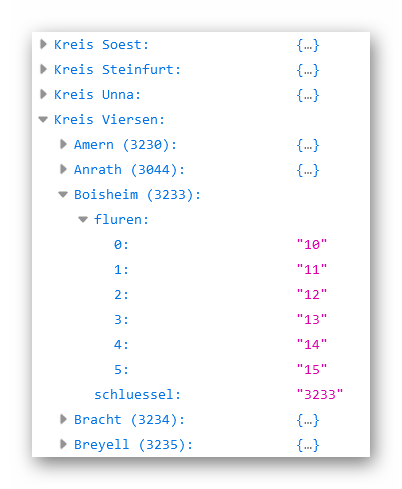

# gemarkungen-fluren-nrw

Dieses Repository dient dazu, regelmäßig und automatisch die Gemarkungen und Fluren in NRW auf Basis der WFS-Daten von https://www.wfs.nrw.de/geobasis/wfs_nw_alkis_vereinfacht strukturiert nach Katasterbezirken im JSON-Format bereit zu stellen.

## URL zum Abruf der JSON-Datei:
https://kreis-viersen.github.io/gemarkungen-fluren-nrw/data/gemarkungen_fluren_nrw.json

## Struktur der JSON-Datei:

## Lizenz der Daten

Die Daten im Verzeichnis `data` stehen unter der Datenlizenz Deutschland – Zero – Version 2.0: 
https://www.govdata.de/dl-de/zero-2-0
