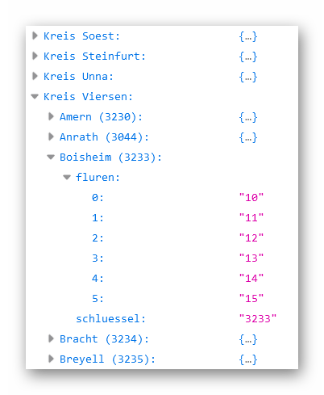

# katasteraemter-gemarkungen-fluren-nrw

Dieses Repository dient dazu, automatisch Angaben zu Gemarkungen und Fluren in NRW auf Basis von OGC API - Features von 
[Geobasis NRW](https://www.bezreg-koeln.nrw.de/brk_internet/geobasis/index.html) strukturiert nach Katasterbezirken im JSON-Format für den [Flurstücksfinder NRW](https://github.com/kreis-viersen/flurstuecksfinder-nrw) bereit zu stellen.

Verwendeter Dienst: 
[https://ogc-api.nrw.de/lika/v1/collections/katasterbezirk/](https://ogc-api.nrw.de/lika/v1/collections/katasterbezirk/)

## URL zum Abruf der JSON-Datei
[https://kreis-viersen.github.io/katasteraemter-gemarkungen-fluren-nrw/data/katasteraemter-gemarkungen-fluren-nrw.json](https://kreis-viersen.github.io/katasteraemter-gemarkungen-fluren-nrw/data/katasteraemter-gemarkungen-fluren-nrw.json)

## Struktur der JSON-Datei

## Aktualisierungsrhythmus

Die JSON-Datei und die Datei mit dem zugehörigen MD5-Hashwert im Verzeichnis `data` werden bei Bedarf täglich jede Nacht automatisch aktualisiert.

URL zum Abruf der Datei mit dem MD5-Hashwert: 
[https://kreis-viersen.github.io/katasteraemter-gemarkungen-fluren-nrw/data/katasteraemter-gemarkungen-fluren-nrw.json.md5](https://kreis-viersen.github.io/katasteraemter-gemarkungen-fluren-nrw/data/katasteraemter-gemarkungen-fluren-nrw.json.md5)

## Lizenz der Daten

Die Daten im Verzeichnis `data` stehen unter der _Datenlizenz Deutschland – Zero – Version 2.0_ 
[https://www.govdata.de/dl-de/zero-2-0](https://www.govdata.de/dl-de/zero-2-0)
